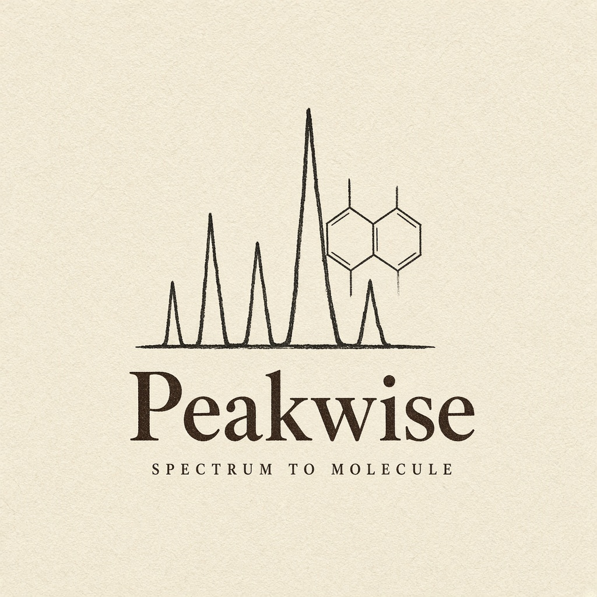

# Peakwise

**Name the molecule in your mass spectrum.**

A mass spectrometer can see thousands of compounds in a drop of blood. It does not tell you their names. Peakwise is a small, readable tool that takes an LC-MS/MS peak list and ranks chemical structures (SMILES) — for known drugs and metabolites, and for close cousins that might be new medicines or disease markers.

The public site runs **in any modern browser**, including phones, and can be hosted on **GitHub Pages** with no Python server. The full local copy adds the trained fingerprint model.



## Use it on any device

| Where | What you get |
| --- | --- |
| GitHub Pages | Identify tab with bundled examples, library browse, glossary, scores |
| This laptop | Same UI plus the trained model, analog generator, batch MGF |

Public URL after you push (repo name `peakwise`):

`https://arnold-rg.github.io/peakwise/`

### Put it on GitHub

```powershell
cd C:\Users\ateck\ionscribe
git init
git add .
git commit -m "Peakwise: spectrum to molecule"
gh repo create peakwise --public --source=. --remote=origin --push
```

Then: GitHub → **Settings → Pages → Build and deployment → GitHub Actions**.

The workflow in `.github/workflows/pages.yml` builds the frontend and publishes it. The Identify tab works on Pages in **demo mode** (no install). Phones get a home-screen icon via `manifest.webmanifest`.

## Keep GitHub updated

After you change files, run:

```powershell
cd C:\Users\ateck\ionscribe
.\scripts\sync-github.ps1
```

That commits and pushes to [Arnold-RG/peakwise](https://github.com/Arnold-RG/peakwise). GitHub Pages then rebuilds the public site. A local `post-commit` hook also pushes whenever you commit.

## Run locally (full model)

```powershell
cd C:\Users\ateck\ionscribe
.\.venv\Scripts\python.exe scripts\build_library.py
.\.venv\Scripts\python.exe -m uvicorn backend.app.main:app --host 127.0.0.1 --port 8000
```

```powershell
cd C:\Users\ateck\ionscribe\frontend
npm install
npm run dev
```

Open [http://127.0.0.1:5173](http://127.0.0.1:5173).

## How to identify a spectrum

1. Open **Identify**.
2. Leave the caffeine list, or paste `mass height` pairs (spaces or commas).
3. Press **Name this spectrum**.
4. Read the ranked names, the “why this ranking” notes, and the mirror plot.

If a word is unfamiliar, open **Plain English**.

## What is inside

- Library search (cosine + modified cosine)
- Fingerprint model (local)
- Formula guessing from precursor mass
- Nearby-molecule edits for novel guesses
- Batch MGF/MSP (local API)
- Held-out scaffold metrics

## Held-out numbers (bundled set)

| | Top-1 | Top-10 | Tanimoto@1 |
|---|---|---|---|
| Hybrid | 67% | 100% | 0.75 |
| Cosine | 71% | 100% | 0.82 |

## Layout

```
backend/app/     chemistry, spectra, model, API
frontend/         Peakwise UI (GitHub Pages)
scripts/          library build + training
```

Not a medical device. Treat every name as a hypothesis.
